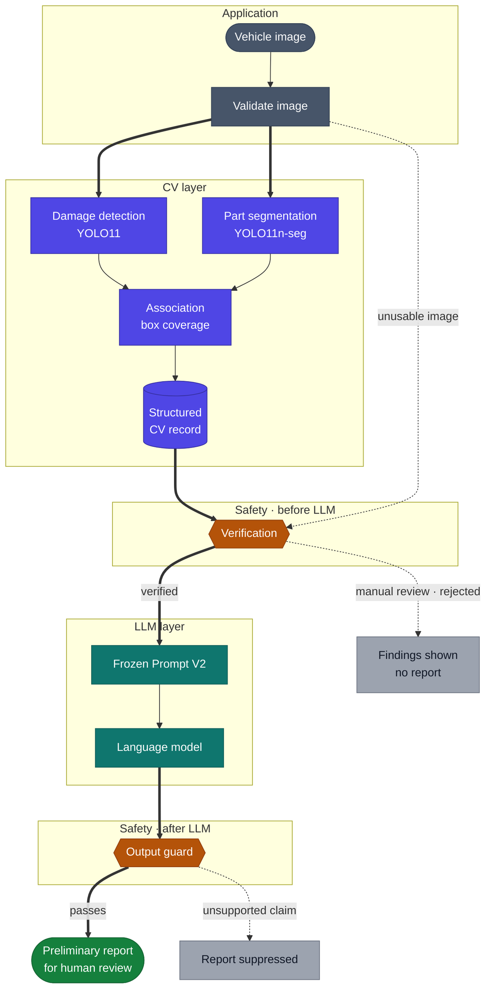
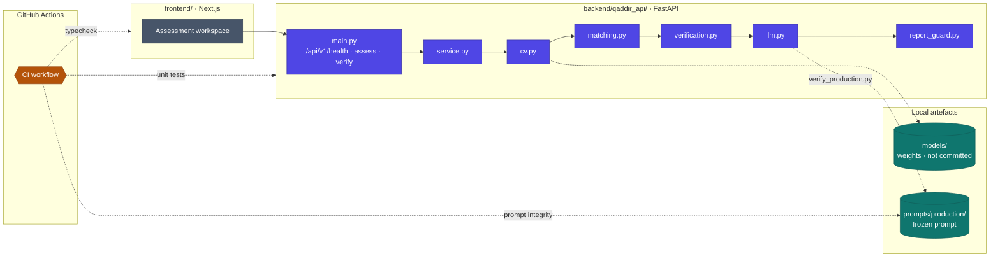

<div align="center">

<h1>Qaddir</h1>

<p><strong>AI-Assisted Preliminary Vehicle Damage Assessment</strong></p>

<p>
Computer vision finds visible damage and the vehicle part it affects.<br/>
A guarded language model reports only what was detected — for a person to review, never to decide.
</p>

<p>
<sub><b>LIVE</b></sub>&nbsp;
<a href="https://github.com/Haifald/qaddir-vehicle-damage-assessment/actions/workflows/ci.yml"></a>


</p>

<p>
<sub><b>RECORDED</b></sub>&nbsp;
<a href="#model-status"></a>
<a href="#model-status"></a>
<a href="#safety"></a>
<a href="#project-health"></a>
</p>

<sub><b>Live</b> badges update automatically from GitHub. <b>Recorded</b> states reflect the evaluation records linked below.</sub>

<br/><br/>

<a href="#overview">Overview</a> ·
<a href="#pipeline">Pipeline</a> ·
<a href="#model-status">Models</a> ·
<a href="#results">Results</a> ·
<a href="#dataset">Dataset</a> ·
<a href="#safety">Safety</a> ·
<a href="#architecture">Architecture</a> ·
<a href="#setup">Setup</a> ·
<a href="#roadmap">Roadmap</a>

<br/><br/>

<table>
<tr>
<td align="center" width="25%"><sub>VEHICLE PARTS</sub><h2>0.707</h2><sub>mask mAP50-95<br/>locked test split · selected model</sub></td>
<td align="center" width="25%"><sub>DAMAGE DETECTION</sub><h2>0.503</h2><sub>box mAP50-95<br/>Exp7 YOLO11m · test split</sub></td>
<td align="center" width="25%"><sub>ADVERSARIAL INPUTS</sub><h2>4 / 4</h2><sub>handled by Prompt V2<br/>Prompt V1: 0 / 4</sub></td>
<td align="center" width="25%"><sub>REPORT SAFETY</sub><h2>0</h2><sub>hallucinations<br/>11 reports reviewed by hand</sub></td>
</tr>
</table>

<sub>Prompt results were generated with Claude Sonnet 5. The application calls the OpenAI Responses API and has not yet been re-evaluated on it.</sub>

</div>



> [!IMPORTANT]
> Qaddir never states severity, cause, repair, cost or safety — and never says a vehicle is undamaged. *"No damage was detected"* describes the system, not the car. See [Safety](#safety).

---

## Overview

Assessing vehicle damage from photographs is manual, slow and inconsistent: the same images can lead different assessors to different conclusions.

Qaddir splits the problem at a hard boundary.

- **Computer vision** detects damage across 6 classes and segments vehicle parts across 13, then links each damage to the part it overlaps.
- **A structured record** captures only what the models detected: classes, confidences and damage-to-part links.
- **A language model** writes a preliminary report from that record alone, under a written specification of what it may and may not say.

Every statement in a report must trace back to a field in the record. The output is a preliminary aid for human review, not a final assessment.

## Pipeline

The diagram above is the request flow implemented in [`backend/qaddir_api/service.py`](backend/qaddir_api/service.py) and documented in [`docs/application_architecture.md`](docs/application_architecture.md). Solid arrows show the path to a report. Dotted arrows show where a request stops short of one.

| Stage | What happens | Implemented in |
|---|---|---|
| **Validate** | Checks the upload; an unusable image skips inference entirely | [`cv.py`](backend/qaddir_api/cv.py) |
| **Detect** | Damage detection and part segmentation run on the same image | [`cv.py`](backend/qaddir_api/cv.py) |
| **Associate** | Links each damage to parts by damage-box coverage, keeping up to three ranked alternatives | [`matching.py`](backend/qaddir_api/matching.py) |
| **Structure** | Builds a typed record that rejects unknown fields | [`schemas.py`](backend/qaddir_api/schemas.py) |
| **Verify** | Classifies the record `verified`, `manual_review` or `rejected`; only `verified` reaches the LLM | [`verification.py`](backend/qaddir_api/verification.py) |
| **Generate** | Loads the frozen prompt only after its integrity check passes | [`llm.py`](backend/qaddir_api/llm.py) |
| **Guard** | Suppresses a report that matches prohibited-term patterns or names a class absent from the record | [`report_guard.py`](backend/qaddir_api/report_guard.py) |

## Model Status

| Component | Artifact | Task | Evaluation | Status |
|---|---|---|---|:--:|
| **Vehicle-part model** | YOLO11n-seg<br/><sub>`carparts_yolo11n_wheel_fixed_v3_best.pt`</sub> | Instance segmentation · 13 classes | Test mask mAP50-95 **0.707** on a locked split, opened once |  |
| **Damage model** | YOLO11m · Exp7 | Detection · 6 classes | Test box mAP50-95 **0.503**; no selection rationale recorded |  |
| **Association** | `associate_by_overlap` | Damage-to-part linking | No accuracy evaluation in the repository |  |
| **Verification & output guard** | `verification.py` · `report_guard.py` | Fail-closed gates | Backend unit tests, run in CI |  |
| **Report prompt** | Prompt V2, frozen and SHA-256 pinned | Grounded reporting | 4 / 4 adversarial inputs; 0 hallucinations in 11 reviewed reports; evaluated on Claude Sonnet 5 only |  |
| **Thresholds** | 5 policy parameters | Reporting, hedging and association cutoffs | Uncalibrated |  |

<sub>**Evaluated** — measured on held-out data and formally selected · **Experimental** — measured, not formally selected · **Prototype** — working, not validated for its intended use · **Implemented** — built and covered by automated tests · **In Progress** — not yet complete</sub>

> [!WARNING]
> **Trained weights are not in this repository.** The tracked `models/best.pt` is a 1-byte placeholder, not a checkpoint.

## Project Health

<a href="https://github.com/Haifald/qaddir-vehicle-damage-assessment/actions/workflows/ci.yml"></a>

| Area | State | Signal | Evidence |
|---|---|:--:|---|
| Backend pipeline | Implemented · unit tests passing | **live** | CI job *Backend tests* |
| Frozen prompt | Byte-identical to the evaluated Prompt V2 | **live** | CI job *Prompt integrity* |
| Frontend | Implemented · typecheck passing | **live** | CI job *Frontend typecheck* |
| Datasets | Prepared · not committed | recorded | [`data/README.md`](data/README.md) |
| Vehicle-part model | Evaluated · selected | recorded | [Results](#results) |
| Damage model | Experimental | recorded | [Results](#results) |
| Association | Prototype · not evaluated | recorded | [`matching.py`](backend/qaddir_api/matching.py) |
| API | Implemented · not deployed | recorded | no deployment configuration in the repository |
| LLM provider | Not re-evaluated on the configured model | recorded | [`docs/application_architecture.md`](docs/application_architecture.md) |
| Thresholds | Uncalibrated | recorded | [`.env.example`](.env.example) |
| Model weights | Not on `main` | recorded | `models/best.pt` is a 1-byte placeholder |

<sub>**Live** rows are checked by the CI workflow on every push to `main`, so the badge above reflects their current state. **Recorded** rows change only when this README is updated.</sub>

## Results

Results fall into categories that are **not interchangeable** — test, validation and prompt evaluation. Each table states which it is.

### Vehicle-part segmentation · test split

The selected model is the wheel-fixed `v3` baseline. The test split stayed locked through tuning and selection and was evaluated **once**, after the choice was made.

| Metric (mask) | Validation | **Test** |
|---|--:|--:|
| Precision | 0.894 | **0.838** |
| Recall | 0.883 | **0.897** |
| mAP50 | 0.935 | **0.906** |
| mAP50-95 | 0.737 | **0.707** |
| `wheel` mAP50-95 | 0.618 | **0.611** |

**Why this model:** manual tuning raised validation mask mAP50-95 by only +0.003408 — inside the predefined 0.005 practical tolerance — while reducing `wheel` performance, so the baseline was kept. `wheel` remains the weakest class; the notebook lists known inconsistencies in wheel annotations among the remaining limitations.

<sub>Sources: [`09_carparts_wheel_fixed_baseline.ipynb`](notebooks/09_carparts_wheel_fixed_baseline.ipynb) (validation) · [`10_carparts_manual_hyperparameter_tuning.ipynb`](notebooks/10_carparts_manual_hyperparameter_tuning.ipynb) (selection and test)</sub>

### Damage detection · test split

[`YOLOM.ipynb`](notebooks/YOLOM.ipynb) loads the Exp7 YOLO11m checkpoint as its final model and evaluates it once on the 374-image test split (785 instances). The notebook records no rationale for choosing Exp7, and the checkpoint tested is the base Exp7 run, not the fine-tuned variant trained later in the same notebook.

| Precision | Recall | mAP50 | mAP50-95 |
|--:|--:|--:|--:|
| **0.733** | **0.657** | **0.685** | **0.503** |

<details>
<summary><strong>Per-class test results</strong></summary>

<br/>

| Class | mAP50-95 |
|---|--:|
| `tire_flat` | 0.836 |
| `glass_shatter` | 0.817 |
| `lamp_broken` | 0.598 |
| `dent` | 0.295 |
| `scratch` | 0.272 |
| `crack` | **0.199** |

`tire_flat` and `glass_shatter` both exceed 0.80, while `dent`, `scratch` and `crack` all score below 0.30.

<sub>Source: [`YOLOM.ipynb`](notebooks/YOLOM.ipynb), cells 45–46</sub>

</details>

### Damage detection · validation, CarDD Reduced

All four experiments train on the reduced CarDD training set (1,408 images) at image size 640 and are evaluated on the same 810-image validation split.

| Experiment | Model | Precision | Recall | mAP50 | mAP50-95 |
|---|---|--:|--:|--:|--:|
| Exp1 — Baseline | YOLO11n | 0.633 | 0.498 | 0.499 | 0.389 |
| Exp2 — Augmentation | YOLO11n | 0.676 | 0.646 | 0.655 | 0.490 |
| Exp3 — Training strategy | YOLO11n | 0.745 | 0.610 | 0.658 | 0.504 |
| Exp7 | YOLO11m | 0.680 | 0.642 | 0.653 | 0.489 |

<details>
<summary><strong>Source notes and earlier full-CarDD experiments</strong></summary>

<br/>

**Sources.** Exp1–3 come from [`experiments_1_2_3_comparison.csv`](notebooks/NotebooksReducedData/experiments_1_2_3_comparison.csv) and Exp7 from [`YOLOM.ipynb`](notebooks/YOLOM.ipynb). [`experiment_3_final_validation_metrics.csv`](notebooks/NotebooksReducedData/experiment_3_final_validation_metrics.csv) records slightly different Exp3 values (0.740 / 0.608 / 0.654 / 0.500); the table uses the comparison file so Exp1–3 share one source. `YOLOM.ipynb` also tabulates an Exp6 (YOLO11s) result that has no accompanying notebook, so it is omitted.

**Full CarDD.** A separate, earlier track trained on the full CarDD training set. These numbers are **not comparable** with the reduced-set table.

| Experiment | Model | Precision | Recall | mAP50 | mAP50-95 |
|---|---|--:|--:|--:|--:|
| Exp1 — Baseline | YOLO11n | 0.625 | 0.576 | 0.587 | 0.462 |
| Exp2 — Augmentation | YOLO11n | 0.623 | 0.627 | 0.633 | 0.456 |

Exp2 raised recall and mAP50 but lowered precision and mAP50-95. The notebook states that Exp2 counts as an improvement only if it improves meaningfully without degrading important classes, and does not declare one.

<sub>Source: [`10_cardd_experiment_2.ipynb`](notebooks/10_cardd_experiment_2.ipynb)</sub>

</details>

### Report prompt · evaluation

Two prompt versions were scored against one rubric, with its decision rule fixed before scoring. Both ran on 9 well-formed fixtures and 4 adversarial ones: instructions injected into JSON fields, an unrecognised class, and a malformed record.

| | Prompt V1 | **Prompt V2** |
|---|--:|--:|
| Well-formed fixtures — rubric subtotal | 4.5 / 5 | **4.7 / 5** |
| Adversarial fixtures — rubric subtotal | 2.3 / 5 | **5.0 / 5** |
| Adversarial fixtures handled | 0 / 4 | **4 / 4** |
| Critical defects | 3 | **0** |

**Prompt V2 was selected** on the pre-registered safety gate. A separate manual review of 11 V2 reports, checked claim by claim against their inputs, found **0 hallucinations and 0 omissions** across ~29 claims, with 8 of 11 reports fully supported.

<sub>Sources: [`prompts/evaluation/RESULTS.md`](prompts/evaluation/RESULTS.md) · [`prompts/evaluation/manual_review.md`](prompts/evaluation/manual_review.md) · [`prompts/v2/README.md`](prompts/v2/README.md)</sub>

## Safety

The language model is a transcription layer, not an assessor. Its limits are written down in [`docs/llm_scope_and_constraints.md`](docs/llm_scope_and_constraints.md) and enforced in code on both sides of the model.

| It may | It never |
|---|---|
| Name a damage class present in the record | Assesses severity, extent or cause |
| Name a vehicle part the evidence licenses | Recommends a repair or estimates cost |
| Hedge a low-confidence finding visibly | States safety, roadworthiness or liability |
| List competing parts when the link is ambiguous | Identifies the vehicle, owner or location |
| Say that *no damage was detected* | Says the vehicle is undamaged |

**Four layers of enforcement:**

1. **Verification** rejects or holds for manual review any record with unknown classes, broken references, contradictions or uncertain confidence — before the LLM is called. <sub>[`verification.py`](backend/qaddir_api/verification.py)</sub>
2. **The prompt** instructs the model to treat every JSON field as untrusted data, and never to obey, quote or mention instruction-like text found inside it. It held on all 4 adversarial fixtures. <sub>[`prompt_v2.md`](prompts/v2/prompt_v2.md)</sub>
3. **The output guard** suppresses a generated report that matches prohibited-term patterns or names a class absent from the record. <sub>[`report_guard.py`](backend/qaddir_api/report_guard.py)</sub>
4. **Integrity pinning** stops the application loading the prompt unless it is byte-identical to the evaluated version. CI checks this on every push. <sub>[`verify_production.py`](prompts/production/verify_production.py)</sub>

<details>
<summary><strong>Known follow-ups from the manual review</strong></summary>

<br/>

The manual review found four substantive issues in the frozen prompt. Each describes real evidence inaccurately rather than inventing any, and all are recorded for a future prompt version rather than patched into the evaluated one:

- A report can say *"no damage was detected"* while its appendix lists detections below the reporting threshold.
- Appendix text asserts that suppressed detections were not matched to parts, even when one was.
- A high-confidence detection with an unrecognised class is filed under "low-confidence detections".
- An image id containing injected text is truncated without saying so.

<sub>Source: [`prompts/evaluation/manual_review.md`](prompts/evaluation/manual_review.md)</sub>

</details>

## Architecture



The API exposes `GET /api/v1/health`, which reports readiness separately for CV, thresholds, the frozen prompt and the LLM provider; `POST /api/v1/assess`, which runs the pipeline on one image; and `POST /api/v1/verify`, which checks a CV record without calling an LLM. Interactive docs are served at `/docs`.

## Dataset

| Dataset | Role | Scale | Preparation |
|---|---|---|---|
| **CarDD** | Damage detection | 4,000 images · 8,740 annotations · splits 2,816 / 810 / 374 | COCO annotations converted to YOLO format, splits preserved |
| **Carparts-Seg** | Vehicle-part segmentation | 3,833 label files · 23 source classes | 135 empty label files and 12 files containing the ambiguous `object` class excluded; direction-specific doors, lights and mirrors merged, giving 13 classes |
| **Humans in the Loop** (external) | Additional part data | 998 image–annotation pairs · 9,189 polygons mapped to 12 of 13 classes | Audited visually and checked for duplicates before merging |

The final part-model dataset (Carparts-Seg plus external data) is split **3,269 / 561 / 554** images, built at source-image level so augmented versions of one image never cross a split boundary. Datasets are not stored in the repository; see [`data/README.md`](data/README.md) for the expected layout.

<sub>Sources: [`docs/cardd_data_card.md`](docs/cardd_data_card.md) · [`03_carparts_preprocessing.ipynb`](notebooks/03_carparts_preprocessing.ipynb) · [`04_carparts_cleaning_and_preparation.ipynb`](notebooks/04_carparts_cleaning_and_preparation.ipynb) · [`06_external_carparts_data_audit.ipynb`](notebooks/06_external_carparts_data_audit.ipynb) · [`09_carparts_wheel_fixed_baseline.ipynb`](notebooks/09_carparts_wheel_fixed_baseline.ipynb)</sub>

<details>
<summary><strong>Class taxonomies</strong></summary>

<br/>

**Damage — 6 classes.** Kept from CarDD with no merges or exclusions. The order is fixed and baked into trained weights; three names were changed to snake_case.

| ID | Class | CarDD annotations |
|:--:|---|--:|
| 0 | `dent` | 2,543 |
| 1 | `scratch` | 3,595 |
| 2 | `crack` | 898 |
| 3 | `glass_shatter` | 681 |
| 4 | `lamp_broken` | 704 |
| 5 | `tire_flat` | 319 |

**Vehicle parts — 13 classes**, merged from 23:

`back_bumper` · `back_door` · `back_glass` · `back_light` · `front_bumper` · `front_door` · `front_glass` · `front_light` · `hood` · `side_mirror` · `trunk_or_tailgate` · `truck_bed` · `wheel`

`trunk_or_tailgate` and `truck_bed` reflect a correction made after a cross-dataset review showed the source `trunk` class meant different things in each dataset.

<sub>Sources: [`docs/damage_classes.md`](docs/damage_classes.md) · [`docs/cardd_data_card.md`](docs/cardd_data_card.md) · [`config.py`](backend/qaddir_api/config.py) · [`08_carparts_corrected_augmentation_training.ipynb`](notebooks/08_carparts_corrected_augmentation_training.ipynb)</sub>

</details>

<details>
<summary><strong>Repository structure</strong></summary>

<br/>

```text
qaddir-vehicle-damage-assessment/
├── .github/workflows/     CI: prompt integrity, backend tests, frontend typecheck
├── backend/
│   ├── qaddir_api/        FastAPI service: CV, matching, schema, verification, LLM, output guard
│   └── tests/             Backend unit tests
├── frontend/              Next.js assessment interface
├── notebooks/             Data analysis, preparation and training experiments
│   └── NotebooksReducedData/   Reduced-CarDD experiments and result CSVs
├── prompts/
│   ├── v1/  v2/           Prompt versions, fixtures and stored outputs
│   ├── evaluation/        Rubric, scorer, results and manual review
│   └── production/        Frozen production prompt and integrity verifier
├── docs/                  Architecture, data card, taxonomy, LLM constraints
├── references/            Taqeem vehicle-assessment standards and extracted text
├── scripts/               Reference PDF extraction
├── data/                  Local dataset layout (datasets not committed)
├── models/                Local model weights (not committed)
├── src/qaddir/            Importable package skeleton
├── .env.example           Runtime configuration template
└── pyproject.toml
```

</details>

<details>
<summary><strong>Repository activity</strong></summary>

<br/>


<sub>All values update automatically. Project tasks are tracked as GitHub Issues.</sub>

</details>

## Setup

**Requirements:** Python 3.10+, Node.js with npm.

**Backend** — from the repository root:

```bash
python3 -m venv .venv
source .venv/bin/activate
pip install -r backend/requirements.txt
cp .env.example .env
uvicorn qaddir_api.main:app --app-dir backend --env-file .env --reload
```

**Frontend** — in a second terminal:

```bash
cd frontend
npm install
npm run dev
```

The interface runs at `http://localhost:3000`, the health check at `http://localhost:8000/api/v1/health`, and API docs at `http://localhost:8000/docs`.

Without model weights, inference settings, thresholds and an API key configured in `.env`, the application still starts. Its readiness panel names each missing component, and image analysis returns an error rather than simulated results.

For the notebooks, install the root [`requirements.txt`](requirements.txt) instead. To run the backend tests exactly as CI does:

```bash
python -m unittest discover -s backend/tests -t backend
```

## Roadmap

Progress recorded in the repository.

- [x] Damage and vehicle-part taxonomies fixed
- [x] Datasets cleaned, merged and split at source-image level
- [x] Vehicle-part model selected and evaluated on a locked test split
- [x] Damage model Exp7 evaluated on the test split
- [x] Backend pipeline with pre- and post-LLM safety gates
- [x] Prompt V2 selected, frozen and integrity-pinned
- [x] CI for prompt integrity, backend tests and frontend typecheck
- [ ] Record a selection rationale for the damage model
- [ ] Evaluate damage-to-part association accuracy
- [ ] Calibrate the five reporting thresholds
- [ ] Supply trained weights for both models
- [ ] Re-evaluate the frozen prompt on the configured OpenAI model
- [ ] Address the four manual-review findings in a new prompt version
- [ ] Run the pipeline end to end on real images

## References

- **CarDD** — Wang, Li & Wu, *CarDD: A New Dataset for Vision-Based Car Damage Detection*, IEEE Transactions on Intelligent Transportation Systems, 24(7):7202–7214, 2023. [doi:10.1109/TITS.2023.3258480](https://doi.org/10.1109/TITS.2023.3258480)
- **Professional Standards for Vehicle Damage Assessment** — Saudi Authority for Accredited Valuers (Taqeem). See [`docs/references.md`](docs/references.md).

---

<div align="center">
<sub>Qaddir supports preliminary assessment only. It does not replace professional vehicle inspection.</sub>
</div>
