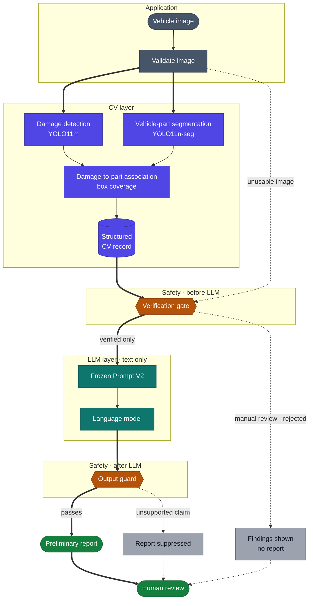
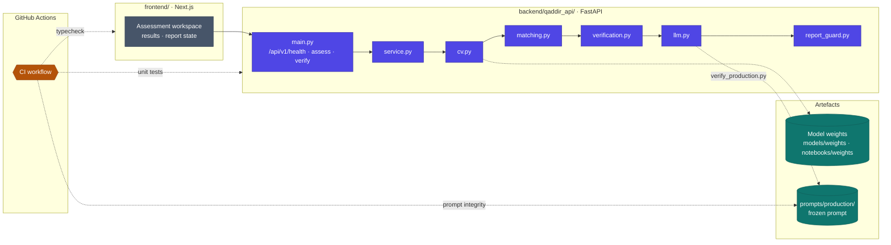

<div align="center">

<h1>Qaddir</h1>

<p><strong>AI-Assisted Preliminary Vehicle Damage Assessment</strong></p>

<p>
Computer vision finds visible damage and the vehicle part it affects.<br/>
A guarded language model reports only verified findings — for a person to review, never to decide.
</p>

<p>
<sub><b>LIVE</b></sub>&nbsp;
<a href="https://github.com/Haifald/qaddir-vehicle-damage-assessment/actions/workflows/ci.yml"></a>


</p>

<p>
<sub><b>RECORDED</b></sub>&nbsp;
<a href="#model-status"></a>
<a href="#model-status"></a>
<a href="#integrated-system-evaluation--held-out-images"></a>
<a href="#current-status"></a>
</p>

<sub><b>Live</b> badges update automatically from GitHub. <b>Recorded</b> states reflect the evaluation records linked below.</sub>

<br/><br/>

<a href="#overview">Overview</a> ·
<a href="#pipeline">Pipeline</a> ·
<a href="#current-status">Status</a> ·
<a href="#results">Results</a> ·
<a href="#safety">Safety</a> ·
<a href="#architecture">Architecture</a> ·
<a href="#setup">Setup</a> ·
<a href="#testing-and-evaluation">Testing</a> ·
<a href="#documentation">Docs</a> ·
<a href="#roadmap">Roadmap</a>

<br/><br/>

<table>
<tr>
<td align="center" width="25%"><sub>VEHICLE PARTS</sub><h2>0.707</h2><sub>mask mAP50-95<br/>locked test split</sub></td>
<td align="center" width="25%"><sub>DAMAGE DETECTION</sub><h2>0.503</h2><sub>box mAP50-95<br/>Exp7 YOLO11m · 374-image test split</sub></td>
<td align="center" width="25%"><sub>END-TO-END RUNS</sub><h2>311 / 311</h2><sub>held-out images completed<br/>0 pipeline failures</sub></td>
<td align="center" width="25%"><sub>WARM LATENCY</sub><h2>108 ms</h2><sub>p50 per image · CPU<br/>p95 115 ms</sub></td>
</tr>
</table>

</div>



> [!IMPORTANT]
> **The language model never sees the image.** It receives only a verified structured CV record. Every result is preliminary, and a qualified human assessor remains responsible for the final decision. Qaddir never states severity, cause, repair, cost or safety, and never says a vehicle is undamaged.

---

## Overview

Assessing vehicle damage from photographs is manual, slow and inconsistent: the same images can lead different assessors to different conclusions.

Qaddir splits the problem at a hard boundary.

- **Computer vision** detects damage across 6 classes and segments vehicle parts across 13, then links each damage to the parts it overlaps.
- **A structured record** captures only what the models detected: classes, confidences and damage-to-part links.
- **A verification gate** decides whether that record is trustworthy enough to be described at all.
- **A language model** writes a preliminary report from a verified record alone, under a written specification of what it may and may not say.
- **A human reviewer** makes every decision.

## Pipeline

The diagram above is the request flow implemented in [`service.py`](backend/qaddir_api/service.py). Solid arrows show the path to a report; dotted arrows show where a request stops short of one. Every path ends with human review.

| Stage | What happens | Implemented in |
|---|---|---|
| **Validate** | Checks format, size and readability; an image below the minimum side length skips inference | [`cv.py`](backend/qaddir_api/cv.py) |
| **Detect** | Damage detection and vehicle-part segmentation run on the same image | [`cv.py`](backend/qaddir_api/cv.py) |
| **Associate** | Links each damage to parts by **damage-box coverage** (share of the damage box inside a part box, not IoU), keeping up to three ranked alternatives | [`matching.py`](backend/qaddir_api/matching.py) |
| **Structure** | Builds a typed record that rejects unknown fields | [`schemas.py`](backend/qaddir_api/schemas.py) |
| **Verify** | Classifies the record `verified`, `manual_review` or `rejected`; only `verified` reaches the LLM | [`verification.py`](backend/qaddir_api/verification.py) |
| **Generate** | Loads the frozen prompt only after its integrity check passes, then sends the record as text | [`llm.py`](backend/qaddir_api/llm.py) |
| **Guard** | Suppresses a report that uses prohibited terms or names a class absent from the record | [`report_guard.py`](backend/qaddir_api/report_guard.py) |

### Technology

| Layer | Stack |
|---|---|
| Computer vision | Python · Ultralytics YOLO11 (detection and instance segmentation) |
| API | FastAPI · Pydantic · Uvicorn |
| Report generation | OpenAI Responses API (configurable model) · frozen, integrity-pinned prompt |
| Interface | Next.js · React · TypeScript |
| Quality | GitHub Actions CI · `unittest` · TypeScript typecheck |

## Current Status

> [!NOTE]
> **Live report generation is intentionally blocked.** The five production confidence thresholds are uncalibrated, so verification holds every record for manual review or rejects it, and no record reaches the language model. The application therefore shows detections, part links and the verification outcome, but not a generated report. This is the designed fail-closed behaviour, not a fault.

| Component | Artifact | Evaluation | Status |
|---|---|---|:--:|
| <a id="model-status"></a>**Vehicle-part model** | YOLO11n-seg · `notebooks/weights/carparts_yolo11n_wheel_fixed_v3_best.pt` | Test mask mAP50-95 **0.707** on a locked split, opened once |  |
| **Damage model** | YOLO11m Exp7 · `models/weights/qaddir_damage_best.pt` (Git LFS) | Test box mAP50-95 **0.503**; no selection rationale recorded |  |
| **Association** | `associate_by_overlap` | Links 93.0% of damages on held-out images; **accuracy not measured** — verified part ground truth is unavailable |  |
| **Verification & output guard** | `verification.py` · `report_guard.py` | Backend tests in CI; behaviour measured on 311 held-out images |  |
| **Report prompt** | Prompt V2, frozen and SHA-256 pinned | Fixture evaluation on Claude Sonnet 5; not evaluated on the configured OpenAI model |  |
| **Thresholds** | 5 policy parameters | Uncalibrated by design until matching accuracy exists |  |
| **Application** | FastAPI backend · Next.js interface | Integration tests, latency profile, usability pass, integrated evaluation |  |

<sub>**Evaluated** — measured on held-out data and formally selected · **Experimental** — measured, not formally selected · **Prototype** — working, not validated for its intended use · **Implemented** — built and covered by automated tests · **In Progress** — not yet complete</sub>

## Results

Results fall into categories that are **not interchangeable** — test split, held-out system run, validation and prompt fixtures. Each table states which it is.

### Vehicle-part segmentation · test split

The selected model is the wheel-fixed `v3` baseline. The test split stayed locked through tuning and selection and was evaluated **once**, after the choice was made.

| Metric (mask) | Validation | **Test** |
|---|--:|--:|
| Precision | 0.894 | **0.838** |
| Recall | 0.883 | **0.897** |
| mAP50 | 0.935 | **0.906** |
| mAP50-95 | 0.737 | **0.707** |
| `wheel` mAP50-95 | 0.618 | **0.611** |

Manual tuning raised validation mask mAP50-95 by only +0.003 — inside the predefined 0.005 tolerance — while reducing `wheel` performance, so the baseline was kept. `wheel` remains the weakest class.

<sub>Sources: [`09_carparts_wheel_fixed_baseline.ipynb`](notebooks/09_carparts_wheel_fixed_baseline.ipynb) · [`10_carparts_manual_hyperparameter_tuning.ipynb`](notebooks/10_carparts_manual_hyperparameter_tuning.ipynb)</sub>

### Damage detection · test split

The Exp7 YOLO11m checkpoint was evaluated once on the full CarDD **374-image test split** (785 instances).

| Precision | Recall | mAP50 | mAP50-95 |
|--:|--:|--:|--:|
| **0.733** | **0.657** | **0.685** | **0.503** |

| Class | `tire_flat` | `glass_shatter` | `lamp_broken` | `dent` | `scratch` | `crack` |
|---|--:|--:|--:|--:|--:|--:|
| mAP50-95 | 0.836 | 0.817 | 0.598 | 0.295 | 0.272 | **0.199** |

The notebook records no rationale for choosing Exp7, and the checkpoint tested is the base Exp7 run, not the fine-tuned variant trained later.

<sub>Source: [`YOLOM.ipynb`](notebooks/YOLOM.ipynb), cells 45–46</sub>

<details>
<summary><strong>Damage experiments · validation split</strong></summary>

<br/>

All four reduced-set experiments train on 1,408 CarDD images at image size 640 and are evaluated on the same 810-image validation split.

| Experiment | Model | Precision | Recall | mAP50 | mAP50-95 |
|---|---|--:|--:|--:|--:|
| Exp1 — Baseline | YOLO11n | 0.633 | 0.498 | 0.499 | 0.389 |
| Exp2 — Augmentation | YOLO11n | 0.676 | 0.646 | 0.655 | 0.490 |
| Exp3 — Training strategy | YOLO11n | 0.745 | 0.610 | 0.658 | 0.504 |
| Exp7 | YOLO11m | 0.680 | 0.642 | 0.653 | 0.489 |

<sub>Sources: [`experiments_1_2_3_comparison.csv`](notebooks/NotebooksReducedData/experiments_1_2_3_comparison.csv) · [`YOLOM.ipynb`](notebooks/YOLOM.ipynb). An earlier full-CarDD track is recorded in [`10_cardd_experiment_2.ipynb`](notebooks/10_cardd_experiment_2.ipynb) and is not comparable.</sub>

</details>

### Integrated system evaluation · held-out images

The complete application path — validation, both models, association, verification and the report gate — was run on **311 unique CarDD test images**, of which **222 have labels** in the local copy of the test split. The language model was not called.

| Measure | Result |
|---|--:|
| Images completed / pipeline failures | **311 / 0** |
| Warm latency per image, p50 / p95 (CPU) | **107.7 / 115.1 ms** |
| Damage box mAP50 / mAP50-95 (222 labelled images) | 0.731 / 0.533 |
| Damage precision / recall at the deployed confidence 0.25 (IoU 0.5) | 0.541 / 0.684 |
| Damage detections linked to a part | 763 / 820 (93.0%) |
| Damage-to-part **accuracy** | **Not measured — verified part ground truth is unavailable** |
| Verification: `verified` / `manual_review` / `rejected` | 0 / 199 / 112 |
| Reports generated | 0 (thresholds uncalibrated) |
| Invalid and non-vehicle inputs handled without a crash | 4 / 4 |

**Key finding.** All 112 rejections come from the strict part-compatibility rule for `glass_shatter`, `lamp_broken` and `tire_flat`, and 78 of the 79 labelled rejected images contain a correctly detected damage — often because a compatible part overlaps an incompatible neighbour such as a bumper. The rule currently removes the most reliable detections from the report path and should be revisited on validation data before thresholds are calibrated.

<sub>Full scorecard, method and recommendations: [`docs/system_evaluation.md`](docs/system_evaluation.md) · data: [`docs/evaluation/`](docs/evaluation/)</sub>

### Report prompt · fixture evaluation

Two prompt versions were scored on one pre-registered rubric using 9 well-formed and 4 adversarial hand-written records. **These results come from Claude Sonnet 5 and do not describe the live backend**, which calls a configurable OpenAI model and has not generated a report on real data.

| | Prompt V1 | **Prompt V2** |
|---|--:|--:|
| Well-formed fixtures — rubric subtotal | 4.5 / 5 | **4.7 / 5** |
| Adversarial fixtures — rubric subtotal | 2.3 / 5 | **5.0 / 5** |
| Adversarial fixtures handled | 0 / 4 | **4 / 4** |
| Critical defects | 3 | **0** |

A manual claim-by-claim review of 11 V2 reports found **0 hallucinations and 0 omissions** across ~29 claims, with 8 of 11 reports fully supported and four substantive wording issues queued for a future prompt version.

<sub>Sources: [`RESULTS.md`](prompts/evaluation/RESULTS.md) · [`manual_review.md`](prompts/evaluation/manual_review.md)</sub>

## Safety

The language model is a transcription layer, not an assessor. Its limits are written in [`docs/llm_scope_and_constraints.md`](docs/llm_scope_and_constraints.md) and enforced in code on both sides of the model.

| It may | It never |
|---|---|
| Name a damage class present in the record | Assesses severity, extent or cause |
| Name a vehicle part the evidence licenses | Recommends a repair or estimates cost |
| Hedge a low-confidence finding visibly | States safety, roadworthiness or liability |
| List competing parts when the link is ambiguous | Identifies the vehicle, owner or location |
| Say that *no damage was detected* | Says the vehicle is undamaged |

1. **Verification** rejects or holds for manual review any record with unknown classes, broken references, contradictions or uncertain confidence — before the LLM is called.
2. **The prompt** treats every JSON field as untrusted data and never obeys instruction-like text inside it.
3. **The output guard** suppresses a report that uses prohibited terms or names a class absent from the record.
4. **Integrity pinning** stops the application loading the prompt unless it is byte-identical to the evaluated version; CI checks this on every push.
5. **The interface** never shows raw errors, internal paths or provider details, and labels every result as preliminary.

## Architecture



The API exposes `GET /api/v1/health` (readiness for CV, thresholds, prompt and LLM), `POST /api/v1/assess` (the full pipeline for one image) and `POST /api/v1/verify` (checks a CV record without calling an LLM). Interactive docs are served at `/docs`.

<details>
<summary><strong>Datasets and class taxonomies</strong></summary>

<br/>

| Dataset | Role | Scale | Preparation |
|---|---|---|---|
| **CarDD** | Damage detection | 4,000 images · 8,740 annotations · splits 2,816 / 810 / 374 | COCO annotations converted to YOLO format, splits preserved |
| **Carparts-Seg** | Vehicle-part segmentation | 3,833 label files · 23 source classes | Empty and ambiguous `object` files excluded; direction-specific classes merged to 13 |
| **Humans in the Loop** (external) | Additional part data | 998 image–annotation pairs | Audited visually and checked for duplicates before merging |

The final part dataset is split **3,269 / 561 / 554** images at source-image level. Datasets are not stored in the repository; see [`data/README.md`](data/README.md).

**Damage — 6 classes:** `dent` · `scratch` · `crack` · `glass_shatter` · `lamp_broken` · `tire_flat`

**Vehicle parts — 13 classes:** `back_bumper` · `back_door` · `back_glass` · `back_light` · `front_bumper` · `front_door` · `front_glass` · `front_light` · `hood` · `side_mirror` · `trunk_or_tailgate` · `truck_bed` · `wheel`

<sub>Sources: [`docs/cardd_data_card.md`](docs/cardd_data_card.md) · [`docs/damage_classes.md`](docs/damage_classes.md) · [`config.py`](backend/qaddir_api/config.py)</sub>

</details>

<details>
<summary><strong>Repository structure</strong></summary>

<br/>

```text
qaddir-vehicle-damage-assessment/
├── .github/workflows/     CI: prompt integrity, backend tests, frontend typecheck
├── backend/
│   ├── qaddir_api/        FastAPI service: CV, matching, schema, verification, LLM, output guard
│   └── tests/             Unit and integration tests
├── frontend/              Next.js assessment interface
├── models/weights/        Exp7 damage checkpoint (Git LFS)
├── notebooks/             Data preparation and training experiments
│   └── weights/           Selected vehicle-part checkpoint
├── prompts/
│   ├── v1/  v2/           Prompt versions, fixtures and stored outputs
│   ├── evaluation/        Rubric, scorer, results and manual review
│   └── production/        Frozen production prompt and integrity verifier
├── docs/                  Architecture, evaluation, testing, demo runbook, data card
│   └── evaluation/        Integrated evaluation results
├── scripts/               System evaluation, latency profiling, reference extraction
├── references/            Taqeem vehicle-assessment standards
├── data/                  Local dataset layout (datasets not committed)
├── .env.example           Runtime configuration template
└── pyproject.toml
```

</details>

## Setup

**Requirements:** Python 3.10+, Node.js with npm, and [Git LFS](https://git-lfs.com) for the damage checkpoint.

```bash
git lfs install
git clone https://github.com/Haifald/qaddir-vehicle-damage-assessment.git
cd qaddir-vehicle-damage-assessment
git lfs pull
```

**Backend** — from the repository root:

```bash
python3 -m venv .venv
source .venv/bin/activate
pip install -r backend/requirements.txt
cp .env.example .env
```

Set the computer-vision entries in `.env` (paths are relative to the repository root):

```dotenv
QADDIR_DAMAGE_MODEL_PATH=models/weights/qaddir_damage_best.pt
QADDIR_PART_MODEL_PATH=notebooks/weights/carparts_yolo11n_wheel_fixed_v3_best.pt
QADDIR_CV_CONFIDENCE=0.25
QADDIR_CV_IMAGE_SIZE=640
QADDIR_CV_DEVICE=cpu
```

Leave `OPENAI_API_KEY`, `QADDIR_LLM_MODEL` and the `QADDIR_T_*` thresholds empty unless calibrated values exist. Never commit `.env`. Then start the API:

```bash
uvicorn qaddir_api.main:app --app-dir backend --env-file .env --reload
```

**Frontend** — in a second terminal:

```bash
cd frontend
npm install
npm run dev
```

Open `http://localhost:3000`. The health check is at `http://localhost:8000/api/v1/health` and API docs at `http://localhost:8000/docs`. With only the CV entries set, the readiness panel shows CV as ready and the report components as pending — the expected state described in [Current Status](#current-status).

## Testing and Evaluation

| Check | Command | Result |
|---|---|---|
| Backend unit and integration tests | `PYTHONPATH=backend python -m unittest discover -s backend/tests -v` | 33 tests passing; run in CI |
| Frontend typecheck | `cd frontend && npm run typecheck` | Passing; run in CI |
| Frontend production build | `cd frontend && npm run build` | Passing |
| Prompt integrity | `python prompts/production/verify_production.py` | Passing; run in CI |
| Integration and latency | see [`docs/integration_testing.md`](docs/integration_testing.md) | Failure paths covered; warm ≈ 111 ms |
| Integrated system evaluation | [`scripts/evaluate_system.py`](scripts/evaluate_system.py) | 311 held-out images; partially complete — see [Results](#integrated-system-evaluation--held-out-images) |
| Demo usability pass | [`docs/demo_runbook.md`](docs/demo_runbook.md) | Primary and backup images verified; fallback path documented |

## Documentation

| Document | Contents |
|---|---|
| [`docs/system_evaluation.md`](docs/system_evaluation.md) | Integrated end-to-end scorecard, findings and recommendations |
| [`docs/integration_testing.md`](docs/integration_testing.md) | Failure-handling matrix, non-vehicle check and latency profile |
| [`docs/demo_runbook.md`](docs/demo_runbook.md) | Demo startup, image order, talking points and fallback plan |
| [`docs/application_architecture.md`](docs/application_architecture.md) | Backend and interface architecture |
| [`docs/llm_scope_and_constraints.md`](docs/llm_scope_and_constraints.md) | What the language model may and may not say |
| [`docs/cardd_data_card.md`](docs/cardd_data_card.md) · [`docs/damage_classes.md`](docs/damage_classes.md) | Dataset card and damage taxonomy |

## Roadmap

- [x] Damage and vehicle-part taxonomies fixed
- [x] Datasets cleaned, merged and split at source-image level
- [x] Vehicle-part model selected and evaluated on a locked test split
- [x] Damage model Exp7 evaluated on the test split and committed
- [x] Backend pipeline with pre- and post-LLM safety gates
- [x] Prompt V2 selected, frozen and integrity-pinned
- [x] Next.js interface with detections, part links, report states and error handling
- [x] Integration testing, latency profiling and demo usability pass
- [x] Pipeline run end to end on 311 held-out images
- [ ] Measure damage-to-part accuracy on a human-verified reference sample
- [ ] Revisit contradiction handling in verification on validation data
- [ ] Calibrate the five reporting thresholds
- [ ] Re-evaluate the frozen prompt on the configured OpenAI model with real records
- [ ] Record a selection rationale for the damage model
- [ ] Address the four manual-review findings in a new prompt version

## References

- **CarDD** — Wang, Li & Wu, *CarDD: A New Dataset for Vision-Based Car Damage Detection*, IEEE Transactions on Intelligent Transportation Systems, 24(7):7202–7214, 2023. [doi:10.1109/TITS.2023.3258480](https://doi.org/10.1109/TITS.2023.3258480)
- **Professional Standards for Vehicle Damage Assessment** — Saudi Authority for Accredited Valuers (Taqeem). See [`docs/references.md`](docs/references.md).

---

<div align="center">
<sub>Qaddir supports preliminary assessment only. It does not replace professional vehicle inspection.</sub>
</div>
