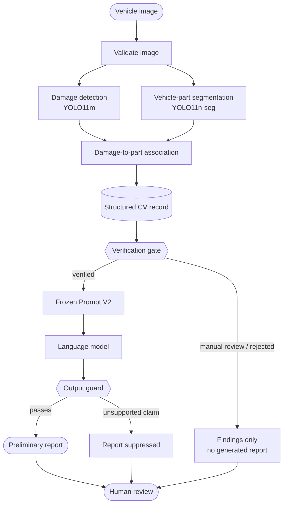
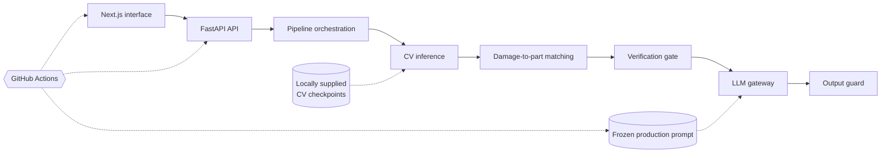

<div align="center">

# Qaddir

### AI-Assisted Preliminary Vehicle Damage Assessment

**Computer vision identifies visible vehicle damage and affected parts.
A guarded language model can describe only verified findings — with a human reviewer always making the final decision.**

[](https://github.com/Haifald/qaddir-vehicle-damage-assessment/actions/workflows/ci.yml)


[Overview](#overview) ·
[Pipeline](#pipeline) ·
[Results](#results) ·
[Safety](#safety-by-design) ·
[Architecture](#architecture) ·
[Setup](#setup) ·
[Documentation](#documentation)

<br/>

| Vehicle Parts           | Damage Detection       | End-to-End Runs         | Warm Latency         |
| ----------------------- | ---------------------- | ----------------------- | -------------------- |
| **0.707** mask mAP50-95 | **0.503** box mAP50-95 | **311 / 311** completed | **108 ms** p50 · CPU |

</div>

---

## Overview

Qaddir is a proof-of-concept system for **preliminary vehicle damage assessment from images**.

The goal is not to replace a professional assessor. Instead, Qaddir explores how AI can make the early assessment stage faster and more structured while keeping important decisions with a human reviewer.

The system combines:

* **Damage detection** across 6 damage classes
* **Vehicle-part segmentation** across 13 normalized part classes
* **Damage-to-part association**
* **A verification layer** that decides whether model outputs are reliable enough to continue
* **Guarded LLM report generation**
* **Human review as the final decision point**

> [!IMPORTANT]
> **The language model never sees the vehicle image.**
> It receives only a verified structured record produced by the computer-vision pipeline.

---

## Why Qaddir?

A straightforward AI pipeline could pass every detection directly to an LLM and ask it to generate an assessment.

Qaddir deliberately does **not** do that.

Computer-vision predictions can be uncertain, contradictory, or incorrectly associated with a vehicle part. Generating polished language from unreliable model outputs can make those errors appear more trustworthy than they are.

Qaddir therefore introduces a verification boundary:

**detect → associate → structure → verify → generate → guard → human review**

If the evidence does not satisfy the verification rules, the system stops before report generation and sends the case to manual review instead.

---

## Pipeline



The orchestration is implemented in [`backend/qaddir_api/service.py`](backend/qaddir_api/service.py).

| Stage         | Purpose                                             | Implementation                                          |
| ------------- | --------------------------------------------------- | ------------------------------------------------------- |
| **Validate**  | Checks image format, dimensions, and readability    | [`cv.py`](backend/qaddir_api/cv.py)                     |
| **Detect**    | Runs damage detection and vehicle-part segmentation | [`cv.py`](backend/qaddir_api/cv.py)                     |
| **Associate** | Links damage detections to candidate vehicle parts  | [`matching.py`](backend/qaddir_api/matching.py)         |
| **Structure** | Builds a typed CV evidence record                   | [`schemas.py`](backend/qaddir_api/schemas.py)           |
| **Verify**    | Returns `verified`, `manual_review`, or `rejected`  | [`verification.py`](backend/qaddir_api/verification.py) |
| **Generate**  | Sends verified structured evidence to the LLM       | [`llm.py`](backend/qaddir_api/llm.py)                   |
| **Guard**     | Blocks unsupported or prohibited report claims      | [`report_guard.py`](backend/qaddir_api/report_guard.py) |

---

## Technology

| Layer             | Stack                                                     |
| ----------------- | --------------------------------------------------------- |
| Computer Vision   | Python · Ultralytics YOLO11                               |
| Backend           | FastAPI · Pydantic · Uvicorn                              |
| Report Generation | OpenAI Responses API · frozen prompt                      |
| Frontend          | Next.js · React · TypeScript                              |
| Testing & Quality | GitHub Actions · Python `unittest` · TypeScript typecheck |

---

## Current Status

Qaddir is an **experimental proof of concept**, not a production assessment system.

The public repository contains the application, verification logic, prompt controls, tests, evaluation artifacts, documentation, and interface.

**Model checkpoints, training datasets, notebooks, and internal experiment files are intentionally excluded from this public portfolio repository.**

Compatible locally supplied checkpoints are required for full CV inference.

Live report generation is also intentionally **fail-closed** while production confidence thresholds remain uncalibrated. When thresholds are not ready, the system can expose detections and verification outcomes but does not allow a record to reach the LLM.

| Component                     | Evaluation                                                      |    Status    |
| ----------------------------- | --------------------------------------------------------------- | :----------: |
| Vehicle-part segmentation     | Test mask mAP50-95 **0.707**                                    |   Evaluated  |
| Damage detection              | Test box mAP50-95 **0.503**                                     | Experimental |
| Damage-to-part association    | 93.0% of detections linked to a part; accuracy not yet measured |   Prototype  |
| Verification layer            | Backend tests + held-out system evaluation                      |  Implemented |
| Output guard                  | Automated backend tests                                         |  Implemented |
| Prompt V2                     | Fixture + adversarial evaluation                                |   Prototype  |
| Production thresholds         | Not yet calibrated                                              |  In progress |
| FastAPI + Next.js application | Integration tested                                              |  Implemented |

---

## Results

### Vehicle-Part Segmentation

The selected vehicle-part model achieved:

| Metric           | Validation |      Test |
| ---------------- | ---------: | --------: |
| Precision        |      0.894 | **0.838** |
| Recall           |      0.883 | **0.897** |
| mAP50            |      0.935 | **0.906** |
| mAP50-95         |      0.737 | **0.707** |
| `wheel` mAP50-95 |      0.618 | **0.611** |

The test split remained locked during tuning and was evaluated after model selection.

Aggregate experiment records are available in [`docs/evaluation/`](docs/evaluation/).

### Damage Detection

The evaluated YOLO11m Exp7 model achieved the following results on the **374-image CarDD test split**:

| Precision |    Recall |     mAP50 |  mAP50-95 |
| --------: | --------: | --------: | --------: |
| **0.733** | **0.657** | **0.685** | **0.503** |

Per-class mAP50-95:

| `tire_flat` | `glass_shatter` | `lamp_broken` | `dent` | `scratch` |   `crack` |
| ----------: | --------------: | ------------: | -----: | --------: | --------: |
|       0.836 |           0.817 |         0.598 |  0.295 |     0.272 | **0.199** |

The model is classified as **experimental** because the project record does not contain a formal selection rationale for the final checkpoint.

### Integrated System Evaluation

The full application path was evaluated on **311 held-out images**.

| Measure                                           |                Result |
| ------------------------------------------------- | --------------------: |
| Completed images / pipeline failures              |           **311 / 0** |
| Warm latency p50 / p95 · CPU                      |  **107.7 / 115.1 ms** |
| Damage box mAP50 / mAP50-95                       |     **0.731 / 0.533** |
| Precision / recall at confidence 0.25             |     **0.541 / 0.684** |
| Damage detections linked to a part                | **763 / 820 (93.0%)** |
| Verification: verified / manual review / rejected |     **0 / 199 / 112** |
| Reports generated                                 |                 **0** |

Damage-to-part **accuracy is not reported** because verified part-level ground truth was not available.

A significant evaluation finding was that the strict part-compatibility rule rejected some otherwise correctly detected damage cases. This should be revisited before production threshold calibration.

See [`docs/system_evaluation.md`](docs/system_evaluation.md) for the full methodology and findings.

---

## Prompt Evaluation

The report-generation prompt was developed through two versions and tested using both normal and adversarial structured records.

|                              | Prompt V1 |   Prompt V2 |
| ---------------------------- | --------: | ----------: |
| Well-formed fixture score    |   4.5 / 5 | **4.7 / 5** |
| Adversarial fixture score    |   2.3 / 5 | **5.0 / 5** |
| Adversarial fixtures handled |     0 / 4 |   **4 / 4** |
| Critical defects             |         3 |       **0** |

Prompt V2 was then frozen and integrity-pinned for the application.

See:

* [`prompts/evaluation/RESULTS.md`](prompts/evaluation/RESULTS.md)
* [`prompts/evaluation/manual_review.md`](prompts/evaluation/manual_review.md)
* [`prompts/production/`](prompts/production/)

---

## Safety by Design

Qaddir treats the language model as a **reporting layer, not an assessor**.

The LLM may describe only findings supported by the structured computer-vision record.

It must not independently infer:

* Severity or damage extent
* Cause of damage
* Repair method
* Repair cost
* Vehicle safety or roadworthiness
* Liability
* Vehicle, owner, or location identity

The application uses several safeguards:

1. **Verification before generation**
   Uncertain or contradictory records are held for manual review before the LLM can be called.

2. **Structured evidence only**
   The LLM receives a structured text record rather than the source image.

3. **Frozen production prompt**
   The evaluated prompt is integrity-pinned and verified before use.

4. **Output guard**
   Reports containing prohibited or unsupported claims are suppressed.

5. **Human-in-the-loop review**
   Every output remains preliminary.

Detailed constraints are documented in [`docs/llm_scope_and_constraints.md`](docs/llm_scope_and_constraints.md).

---

## Architecture



The API exposes:

* `GET /api/v1/health`
* `POST /api/v1/assess`
* `POST /api/v1/verify`

FastAPI interactive documentation is available at `/docs` when the backend is running.

---

## Data

Training datasets are **not distributed in this repository**.

| Dataset                | Role                         | Scale                            |
| ---------------------- | ---------------------------- | -------------------------------- |
| **CarDD**              | Damage detection             | 4,000 images · 8,740 annotations |
| **Carparts-Seg**       | Vehicle-part segmentation    | 3,833 labelled samples           |
| **Humans in the Loop** | Additional vehicle-part data | 998 image-annotation pairs       |

See [`data/README.md`](data/README.md) for dataset acquisition and licensing notes.

### Damage Classes

`dent` · `scratch` · `crack` · `glass_shatter` · `lamp_broken` · `tire_flat`

### Vehicle-Part Classes

`back_bumper` · `back_door` · `back_glass` · `back_light` · `front_bumper` · `front_door` · `front_glass` · `front_light` · `hood` · `side_mirror` · `trunk_or_tailgate` · `truck_bed` · `wheel`

---

## Repository Structure

```text
qaddir-vehicle-damage-assessment/
├── .github/
│   └── workflows/
│       └── ci.yml
├── backend/
│   ├── qaddir_api/
│   ├── tests/
│   └── requirements.txt
├── frontend/
│   ├── app/
│   ├── components/
│   └── lib/
├── prompts/
│   ├── v1/
│   ├── v2/
│   ├── evaluation/
│   └── production/
├── docs/
│   └── evaluation/
├── scripts/
├── data/
│   └── README.md
├── .env.example
├── .gitignore
└── README.md
```

The public repository intentionally excludes:

* Training datasets
* Model checkpoints and `.pt` files
* Training notebooks
* Local environments
* Generated reports
* Internal team working files
* Experiment artifacts not needed to understand the final system

---

## Setup

### Requirements

* Python 3.10+
* Node.js and npm
* Compatible locally supplied YOLO checkpoints for full computer-vision inference

Clone the repository:

```bash
git clone https://github.com/Haifald/qaddir-vehicle-damage-assessment.git
cd qaddir-vehicle-damage-assessment
```

### Backend

Create a virtual environment:

```bash
python -m venv .venv
```

Activate it and install backend dependencies:

```bash
pip install -r backend/requirements.txt
```

Create the local configuration:

```bash
cp .env.example .env
```

Provide paths to compatible local checkpoints:

```dotenv
QADDIR_DAMAGE_MODEL_PATH=/path/to/damage-model.pt
QADDIR_PART_MODEL_PATH=/path/to/part-model.pt

QADDIR_CV_CONFIDENCE=0.25
QADDIR_CV_IMAGE_SIZE=640
QADDIR_CV_DEVICE=cpu
```

> Model checkpoints are intentionally not distributed in this repository.

Start the API:

```bash
uvicorn qaddir_api.main:app --app-dir backend --env-file .env --reload
```

### Frontend

In another terminal:

```bash
cd frontend
npm install
npm run dev
```

Open:

```text
http://localhost:3000
```

Backend health check:

```text
http://localhost:8000/api/v1/health
```

FastAPI docs:

```text
http://localhost:8000/docs
```

---

## Testing and Evaluation

| Check               | Command / Reference                                                  |
| ------------------- | -------------------------------------------------------------------- |
| Backend tests       | `PYTHONPATH=backend python -m unittest discover -s backend/tests -v` |
| Frontend typecheck  | `cd frontend && npm run typecheck`                                   |
| Prompt integrity    | `python prompts/production/verify_production.py`                     |
| Integration testing | [`docs/integration_testing.md`](docs/integration_testing.md)         |
| System evaluation   | [`docs/system_evaluation.md`](docs/system_evaluation.md)             |
| Evaluation script   | [`scripts/evaluate_system.py`](scripts/evaluate_system.py)           |
| Pipeline profiling  | [`scripts/profile_pipeline.py`](scripts/profile_pipeline.py)         |

The cleaned public repository was validated with:

* **33 / 33 backend tests passing**
* Frontend TypeScript typecheck passing
* Production prompt integrity check passing
* Public JSON artifacts parsing successfully
* No recognized live credentials in the cleaned public tree

---

## Documentation

| Document                                                                 | Purpose                            |
| ------------------------------------------------------------------------ | ---------------------------------- |
| [`docs/application_architecture.md`](docs/application_architecture.md)   | Application architecture           |
| [`docs/system_evaluation.md`](docs/system_evaluation.md)                 | End-to-end evaluation and findings |
| [`docs/integration_testing.md`](docs/integration_testing.md)             | Integration and latency testing    |
| [`docs/llm_scope_and_constraints.md`](docs/llm_scope_and_constraints.md) | LLM safety boundaries              |
| [`docs/cardd_data_card.md`](docs/cardd_data_card.md)                     | CarDD usage and licensing notes    |
| [`docs/damage_classes.md`](docs/damage_classes.md)                       | Damage taxonomy                    |
| [`docs/references.md`](docs/references.md)                               | External references                |

---

## Roadmap

* [x] Damage and vehicle-part taxonomies defined
* [x] Vehicle-part segmentation evaluated on a locked test split
* [x] Damage detector evaluated on the CarDD test split
* [x] Damage-to-part association implemented
* [x] Verification layer implemented
* [x] Output guard implemented
* [x] Prompt V2 evaluated and integrity-pinned
* [x] FastAPI backend implemented
* [x] Next.js interface implemented
* [x] Integration testing and latency profiling completed
* [x] End-to-end pipeline evaluated on 311 held-out images
* [ ] Measure damage-to-part accuracy using human-verified references
* [ ] Revisit strict contradiction handling
* [ ] Calibrate production reporting thresholds
* [ ] Evaluate the production prompt with the configured OpenAI model
* [ ] Record a formal damage-model selection rationale
* [ ] Address remaining prompt-review findings

---

## Team

Qaddir was developed as a team graduation project by:

* **Haifa Aldumaykhi**
* **Lena Alshauibi**
* **Ruba Almuziraee**

---

## References

* **CarDD** — Wang, Li & Wu, *CarDD: A New Dataset for Vision-Based Car Damage Detection*, IEEE Transactions on Intelligent Transportation Systems, 24(7):7202–7214, 2023.

---

<div align="center">

**Qaddir supports preliminary assessment only. It does not replace professional vehicle inspection or assessment.**

</div>
